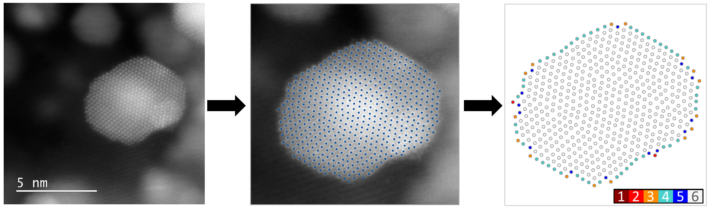

# Atomic-neighbor-analysis
Code for nearest neighbor analysis of atomic columns in scanning transmission electron micrographs of metallic nanoparticles. 

This repository contains code to visualize and manually correct previously determined positions of atomic columns and determine their nearest neighbors to ultimately assess the surface roughness of analyzed Ir nanoparticles. 

If you use the code, please cite the following paper: 

* Atomically-resolved structural changes of ceramic supported nanoparticulate oxygen evolution reaction Ir catalyst. *Electrochimica Acta* (2022). https://doi.org/10.1016/j.electacta.2022.140800 

Example of the nearest neighbor analysis:

  

